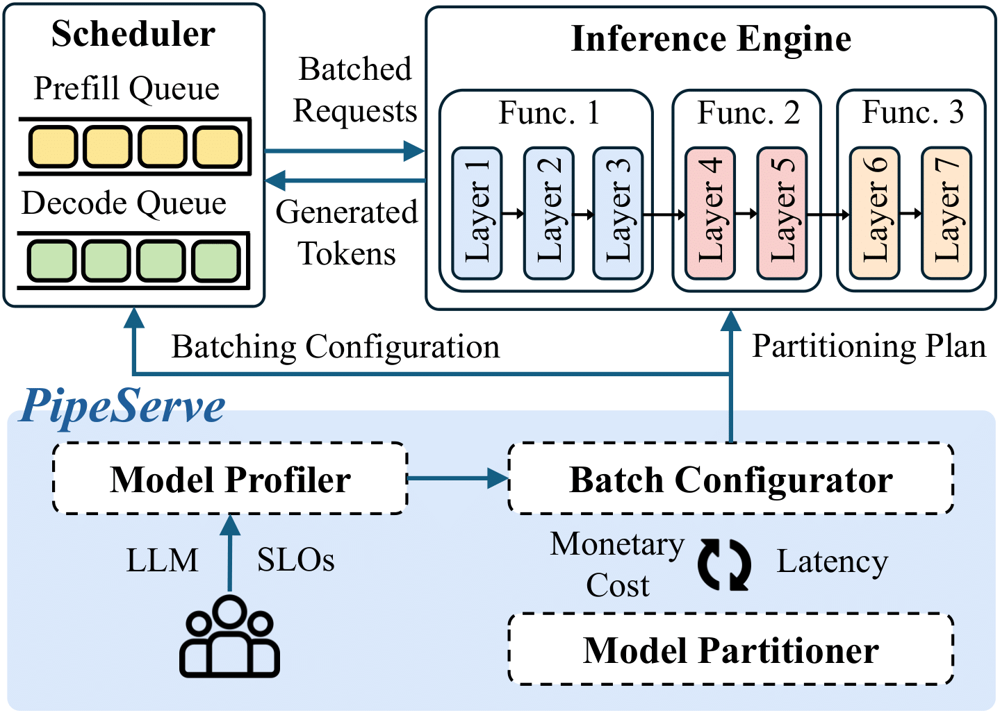

# PipeServe

PipeServe is a cost-efficient serverless LLM inference framework that employs a decoupled combinatorial optimization of adaptive batching and model partitioning.

## Overview

PipeServe integrates three main modules: Model Profiler, Batch Configurator, and Model Partitioner. Users first submit inference jobs to the Model Profiler, which includes a large model, SLOs. The Profiler analyzes the inference time and GPU memory consumption of different layers on GPUs. Leveraging the profiled job statistics above, the Batch Configurator then employs a backward bucket-scan to generate a cost-efficient batch configuration. It further utilizes a SLO-aware non-uniform model partitioning strategy in Model Partitioner to partition model layers into stages, aiming to minimize the pipeline stalls. Finally, the inference job is deployed with the cost-efficient batch configuration and model partitioning plan in the public serverless clouds.



## Getting Started

### Prerequisites

Ensure you have the following dependencies installed:

- Python 3.11
- Torch 2.5.1
- Transformers 4.48.0
- llm-analysis>=0.2.2


### Installation

Clone the repository and install the required packages:

```bash
git clone https://github.com/PipeServe/PipeServe.git
cd PipeServe
pip install -r requirements.txt
```


### Running the Prototype System

To run PipeServe, begin by creating a JSON configuration file for your model and configrations. Here is an example configuration for the model `Llama2-7b`:

```json
{
    "model": "Llama-2-7b",
    "gpu_name": "t4-pcie-16gb",
    "dtype": "w16a16e16",
    "max_chunk_size": 256,
    "slo_prefill": 1.5,
    "slo_decode": 0.5,
    "tp_size": 1,
    "pp_size": 1,
    "sp_size": 1,
    "dp_size": 1,
    "algorithm": "both",
    "verbose": false,
    "quiet": false
}
```

The following Python script demonstrates how PipeServe uses this configuration file to generate an effective batch configuration and model partitioning plan:

```python
from BatchConfigurator import BatchConfigurator

if __name__ == "__main__":
    config_file = "./config.json"
    configurator = BatchConfigurator.from_json_config(config_file)
    min_cost = GPUAllocator.gpu_allocator(model)
    with open("./result.json", "w") as f:
        f.write(json.dumps(min_cost))
```